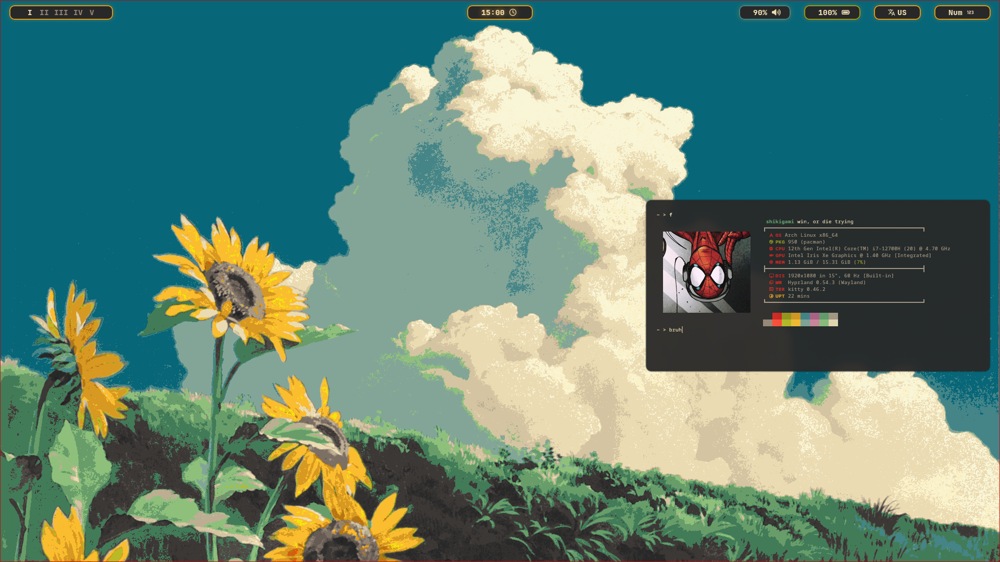
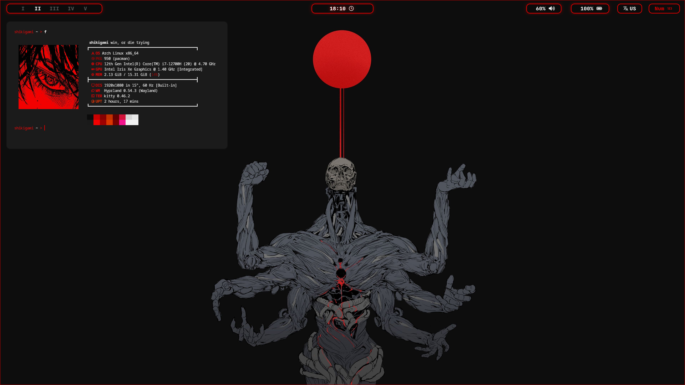

---
# 🐧 Arch Hyprland Dotfiles

A repository for my personal Arch Linux setup running the hyprland wayland compositor. This serves as a personal backup and a potential starting point for anyone who likes this configuration.

---

## 📸 Screenshots





---
## 🛠 Core Components

These are the main configurations found in the `.config` directory:

| **Component**      | **Software** | **Description**                           |
| ------------------ | ------------ | ----------------------------------------- |
| **Window Manager** | `hyprland`   | Tiling window management.                 |
| **Terminal**       | `kitty`      | GPU-accelerated terminal emulator.        |
| **Shell**          | `fish`       | User-friendly interactive shell.          |
| **Status Bar**     | `waybar`     | Highly customizable status bar.           |
| **App Launcher**   | `wofi`       | Window switcher and application launcher. |

---

## 🚀 Software Suite

The daily drivers used in this environment:

- brave
- gthumb
- nautilus
- vs code
- awww
- grim
- dunst & libnotify-bin
- imagemagick
- nwg-lock
- material-black themes (for GTK themes)

---

## ⚙️ Installation

### 1. Prerequisites

Ensure you are on Arch linux and have the necessary repositories enabled.

Bash

```
sudo pacman -S update && sudo apt install hyprland kitty fish waybar wofi thunar awww dunst libnotify-bin gthumb grim
```

### 2. Clone the Repository

Bash

```
git clone https://github.com/Maze-101/Arch-Hyprland-Dotfiles.git
cd Arch-Hyprland-Dotfiles
```

### 3. Apply Configurations

Bash

```
cp -r .config/* ~/.config/
```

---
